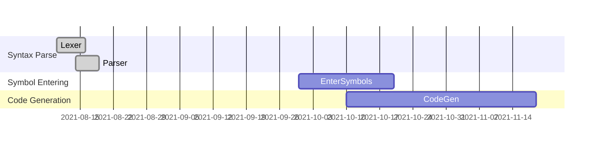
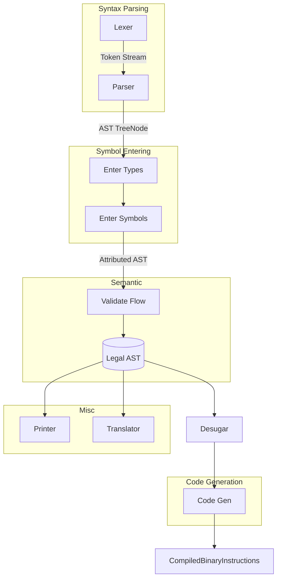
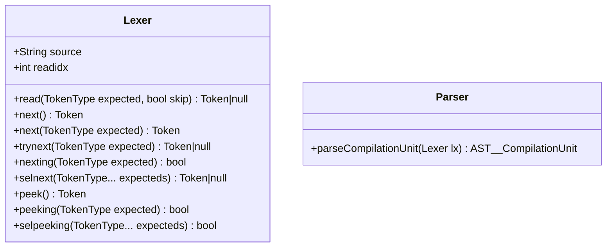

```

namespace mynamspc.special.spc {
    
    class MyType {
        
        int num = 2;
    
        @entrypoint
        static void main() {
            
        }
    
    }
    
}


```


Schedule:

```
langdev-libs
  stl.lang.string               | 2021 aug20 - sept24
  stl.vector linearmath-library | 2021 dec
  stlx.opengl opengl-binding.
  
langdev-features
  pointers 2021 sept10-20
  heap-object-creation
  refied-generics
  const-generics
  lambda
  
graphics
  vr interface
  vulkan
  gui system
  
physics
  rigidbody-dynamics
  collision-detection
  constraint-solve
  
surface-systems
  
microcraft
gymcontroller


```



Workflow:



Components:
