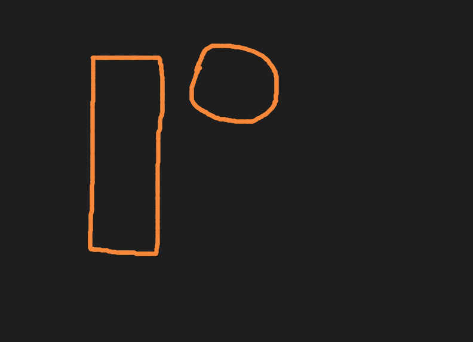
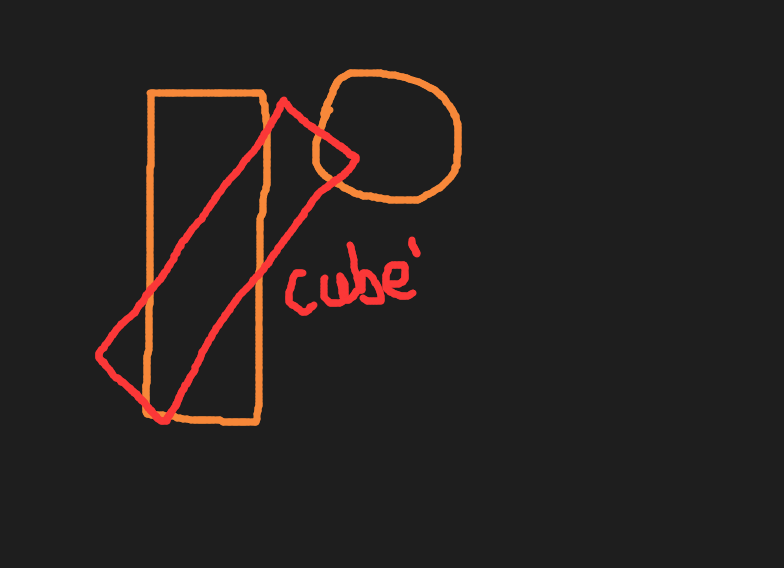

# gjk_supportfunc_wIth_trans

在Gjk中工作时，我有一次突然间无语了。我意识到了一个问题。

在 SupportFunction 中，我们获取两个物体的MinkowskiSum边上的点。但事实上物体通常包含旋转，



若我们仅仅根据形状原本的顶点(无变换)来GetSupportPoints, 那么当图1的正方形发生一定的旋转后，本来不相交的两个形状 现在实则相交了，但由于GetSupportPoints的操作行为 并没有因为正方形旋转而改动 仍然是获取着原本状态的顶点的，所以即使通过考察 现在旋转后的该对形状已经相交，但实则执行起来 则和图1的结果一样 并没有相交 因为实际上旋转/位移在GetSupportPoints的操作中完全被忽略了。



说的好，那我们直接将变换应用于形状(的顶点) 然后再GetSupportPoints 那不就大功告成了吗！听上去好像是个办法，但却又感觉不太可能。。使用分离的outskirts.util.Transform对顶点(vec3)进行变换，需要一次3x3矩阵乘法(另外还有一次vec3向量偏移 虽然相比之下这点可忽略不计)，而一次GJK检测通常较佳情况下可能要进行5次迭代，每次迭代执行一次SupportFunction，从而执行两次GetSupportPoint(shape, vec)，因此这种方法每次GJK检测可能要进行10次形状整体顶点变换，而真正的crest的是 有时形状是非常多非常多顶点的，且场景中通常有巨多的物体。。。至于那10次 虽然可以用缓存降到2次，但即使是1次整体顶点变换实际上都非常要命，时间上terrible的不可行，原本不存在的空间问题上 也将会变得难以接受。事实上 一旦执行该方案，可能开销将瞬间高过同时开5个光线追踪引擎。。

```c
// orgi intention
def_func void opsGetFarthestPoint(shape, trans, vec3 vecD) {
    declar transformed[] = gen_arr(sizeOf(shape.vertices))
    lup vert in shape.vertices:
        transformed[i++] = trans.rot * vert + trans.off
    lup vert in transformed:
        farthest = maximum(vecD dot vert, farthest)
    popfunc farthest;
}

def_func void opsimplDetMain(sp1, sp2) {
    ...
    lup true:
        optprvt_$_SuppFunc(sp1, sp2, d)
        ...
}

[func_optnm]
def_func vec3 optprvt_$_SuppFunc(sp1, sp2, vec3 d) {
    let vec = opsGtFrstPnt(sp1, d)
    vec - opsGFPt(sp2, d*-1)
    popfunc_ret v3_normalize(vec); // norm dir
}
```


然而，对顶点应用逆矩阵可将其恢复。
通过考察dyn4j的方法，可以将方向d还原到旋转变换前(trans.Rot^-1 * vert) 找到单面体顶点后 再对其应用旋转变换。

```
    M^-1 * M = I
           M * V = V'
    M^-1 *(M * V)= V
```

```c
def_func vec3 opsGetFarthestPoint(shape, trans, d) {
    d = mat4_invert(trans.rot) * d;
    
    lup vert in shape.vertices:
        farthest = maximum(vecD dot vert, farthest)
    
    popfunc trans.rot * farthest + trans.off;
}
```

