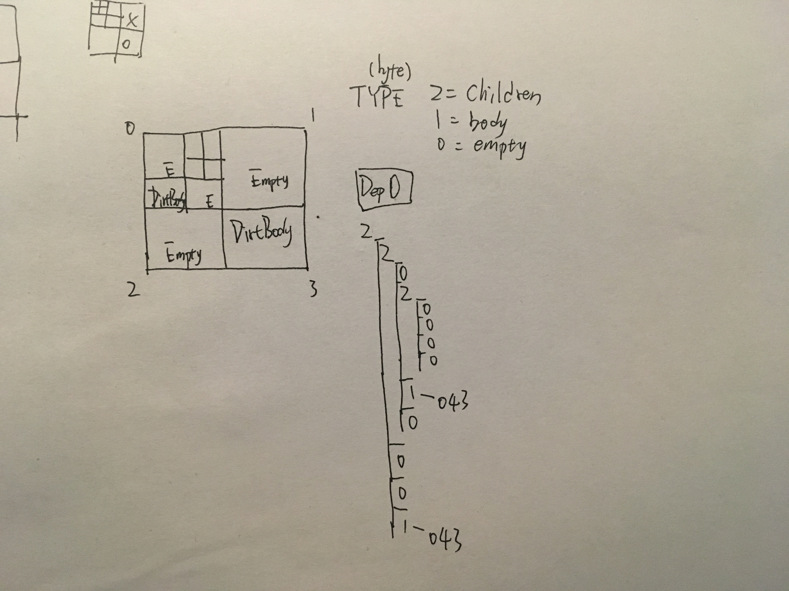

# 八叉树体素结构的持久化方法

通常方块种类为500+类，而有些类别可能会有不同的状态。例草 有是否覆盖雪。。铁砧的损坏程度。。。我们存储的并非方块 而是具体的方块状态/享元标识。

## 固定插槽

在以 16^3 为单元的固定插槽中，最多可存储 4096 个方块。
我们可以在每个单元中定义一个查找表{id, blockstate} 该表内包含该单元所有插槽内的所有方块类型。然后用12bits(2^12=4096)长存储每个方块的方块状态在该查找表内的id。
这样我们每个方块状态只需要12bits的存储长度，在读取时 根据方块的12bits ID数据 查找该单元的查找表中对应的方块状态即可。(虽然可能你们一看就能明白，但是还是稍微补充说明一下，这种方法 即使每个位置都放置着不同的方块，那么也是可以完成所有存储的。因为id容量正好和所有插槽数量相匹。)

这好像有些物尽其用的恰到好处的感觉 12bits完全对齐了16^3的体积。
不过“查找表”的形式 可能存在着一些问题。。。

众所周知，我们为了极佳的扩展性，将方块的注册表ID以字符串"domain:path/identity"的形式。对于以数字作为持久标识 试想，若操作系统的命令不再是cd ls unlink，而是2137 5189 10172 这样的"数字"，那么人们不但难以记住/查找他们且觉得有一点奇怪 而且若一个软件需要增加一个命令 则这样的数字很容易冲突或批量冲突。类似的例子有些数不胜数，Android的软件包标识，cpp的命名空间，java的包名设定。。

然而我们只将字符串作为持久化标识，在运行时及很多地方 我们当然还是使用着数字ID(在基于那些字符串标识的前提)。

所以问题是，查找表将要包含完整的全局标识以确定对应项。而每个16^3单元都需要一个这样的查找表的话，其实是个比较贵的存储开销。。
(我想说事实上根本不只是个开销的问题 我不知道我会不会没必要说这些在此 但这会体现出一个系统的专业性 正确性，一些无厘头的小问题将造成绝顶的限制性 让系统变得和专业的系统形为天壤之别)

我们需要降低查找表的数量 - 提高查找表的范围。有大概两个方式：Chunk/Region查找表，World查找表，Global/SaveRgn查找表。然而无论是两者之一的哪一个，都会于之前说到的12bits长id存储不完好兼容。因为查找表内容的范围变大了，12bits长不再被确保能表示查找表中的某项了(which>=2^12)。(另外一说 虽然是3个，但是其实前两者好像差的不多 说是两个也是Ok的吧。。啊哈？)(K的吧.. 其实是后来分成3个了的。。)

Chunk/Region查找表 将和16^3的Section查找表在一个完全不同的数量级上。该表可能包含太多类型，甚至所有类型。。而World查找表虽然范围增加到了界级，但其实感觉类型和结构并不会有很大区别。。与其重复大量可能包含超多或全部项的具体查找表 使用全局查找表感觉更简名，更全面。。

```
save1dir/
+ blockstates.gtable
+ overworld/
    +r.%pos%.data
    +..

```

## 八叉树插槽

然而这才几乎是正题的开始。。我们如何对目前的八叉树系统进行较为恰当的存储。。

```
identity/0=empty,1=body,2=children

chunk:
oct [
    oct *1 id(grass)
    oct *0
    oct *2 [
        ...
    ]
]

#def id (short)glob_state_table(arg0)

```



然而事实上并不能真正的使用gtable全局表。虽然看上去统一了，但是其实有一些问题。三界浩瀚无垠，存储区块将数不胜数。而一旦实际运行时的运行时表和gtable对不上，那么就要更改/同步存档的gtable 以存储运行时内容，而gtable一改 将涉及到所有区块的所有插槽内容。。。

```
RS. lc-cktable struc v.pre

[blocid, stateslen, statemeta..., blocid, ...

```

即使是查找表，实际上也是存储方块状态标识。遇到未知方块抛出异常，预期方块则正常行驶。

所以还是在chunk 16/256/16 界执行local/cktable。。

然而上面的[v.pre]并不是很恰当作为本地查找表。虽然很好的运用了“有序”存储，但是实际上要产出这样的状态有序表 及每个方块类的状态数量 是需要额外开销的，并且这将定义不必要的更高层的数据结构。


```
RS. lc-cktable struc v.pst

[blocsize, blockid..., statesize, blocIndex&&statemeta...

```

