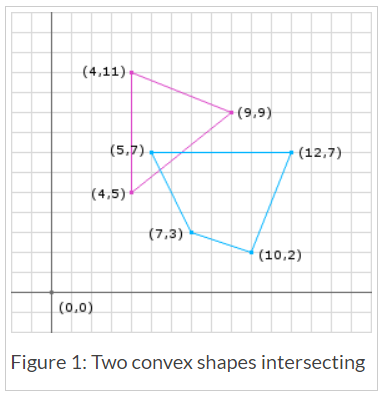
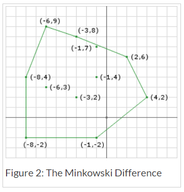
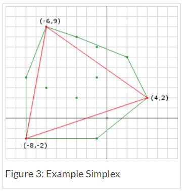
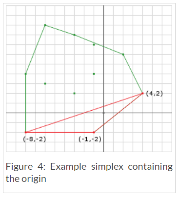
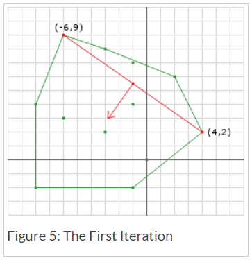
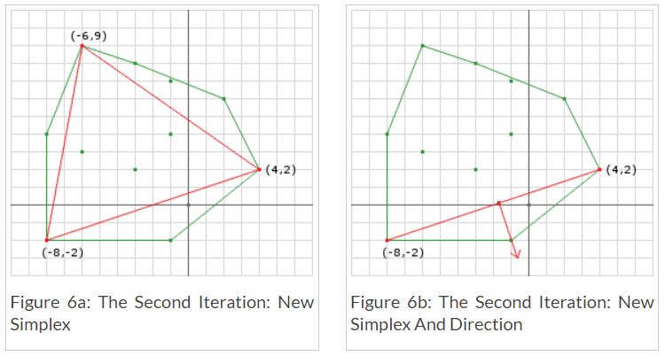
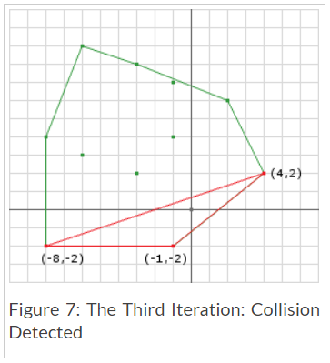
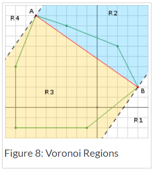
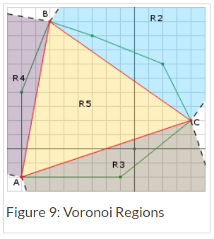

# GJK (Gilbert-Johnson-Keerthi) - DYN4J
Posted on April 13, 2010  \|  <http://www.dyn4j.org/2010/04/gjk-gilbert-johnson-keerthi/>

 原文 | <http://www.dyn4j.org/2010/04/gjk-gilbert-johnson-keerthi/> |
 翻译 | Dreamtowards |
 校对 | OutskirtsSys |
 
 Attempt | #1 | #2 | #3 | #4 | #5 | #6 | #7 | #8 | #9 | #10 | #11
--- | --- | --- | --- |--- |--- |--- |--- |--- |--- |--- |---
Seconds | 301 | 283 | 290 | 286 | 289 | 285 | 287 | 287 | 272 | 276 | 269

今天，我要来谈论另一个封装在dyn4j中的碰撞检测算法。你可以找到许多关于GJK的文档，但是很大一部分文档都比较学术专业 因为他们是研究资料。我强烈推荐这个[视频教程](http://mollyrocket.com/849)，老实说 你可能在看完这个视频后就无需再做进一步阅读。但若你感觉看完视频后还需要更多信息，那么请继续阅读。

1. 介绍
2. 凸性 (Convexity
3. 明可夫斯基和 (Minkowski Sum
4. 单面 (Simplex
5. Support函数
6. 创建单面 (Creating The Simplex
7. 检测碰撞
8. 迭代
9. 检查单面 (Checking The Simplex

## 介绍
就像SAT，GJK只能在凸多边形上进行操作。一个GJK最具吸引力的功能之一是 他可以支持实现了"support函数"(待会将会讨论这个)的任意<sup>(凸多边形)</sup>形状。因此，不像SAT，您无需单独的来处理曲面形状(像用特定的代码或算法)。

GJK是一个迭代方法，但收敛非常快，若你已经准备好了最后一个 渗透/分离(penetration/separation) 向量，那么甚至可以以接近固定的时间运行。这在3D环境中是一个更佳的选择<sup>(相比SAT的话 其实能与其相比的也不多了)</sup>，因为SAT必须测试巨大量的轴。

GJK原本的意图是确定两个凸多边形之间的距离。GJK还可以被用于返回碰撞信息 以获取小的穿透<sup>(信息)</sup>(small penetrations)，并可以通过其他补充算法以获得更深的穿透<sup>(信息)</sup>(deeper penetrations)。

## 凸性 (Convixity
就像我之前说的，GJK是一个只能用于凸多边形的算法。若要获取更多对凸性的解释 可查看我的[SAT](http://www.dyn4j.org/archives/55#sat-convex)文章。

## 明可夫斯基和 (Minkowski Sum
GJK算法很大程度上依赖于一个称为明可夫斯基和的概念。明可夫斯基和从概念上讲很容易理解。假设你有两个形状，这两个形状的明可夫斯基和则是形状1的所有点加上形状2的所有点：

> A + B = { a+b | a∈A, b∈B }

若两个形状都是凸多边形，那么返回的形状也将是一个凸多边形。

你也许会在想，“ok，那很酷，但这和我有是否有什么关系呢？”。其中的意义并非在加法上，若我们选择用减法取而代之：

> A - B = { a-b | a∈A, b∈B }

作为旁注，在我们继续之前，即使我们是在使用"差(difference)"的操作，但这仍然不叫明可夫斯基差(Minkowski Difference)，这仍然是明可夫斯基和。但为了清楚起见，我将在在下文中称这个为明可夫斯基差。

继续，在明可夫斯基和上执行差操作的关键点在于：

> **若两个形状处于 交叠/互交 状态，那么其明可夫斯基差将会包含<sup>空间上</sup>原点。**

让我们看一个例子，于Figure.1的两个形状上执行明可夫斯基差，你将会得到Figure.2的形状。请注意返回的形状包含原点，这是因为这两个形状是相交的。





现在执行该操作需要 shape1.vertices.size * shape2.vertices.size 次减法。这一点是重要的，因为一个形状是由无数的点所组成。因为这两个形状都是凸多边形且是以最外层的顶点定义的，所以我们只需要在那些顶点上执行这个操作。一个关于GJK的很棒的事情是，你**无需**真的去计算明可夫斯基差。

## 单面 (Simplex
我们不想去计算明可夫斯基差。相反，我们只是想知道明可夫斯基差是否包含原点。若包含原点，那么我们将知道形状处于互交状态，否则将不为互交状态。

取而代之，我们能做的是 在明可夫斯基差内<sup>(我认为是在集合元素内而非空间内)</sup>迭代的构建一个试图封闭原点的多边形。若我们构建的多边形包含原点(并包含于明可夫斯基差内)，那么我们可以说该明可夫斯基差包含原点。而这个我们想去构建的多边形称之为单面(Simplex)。

## Support 函数
所以下一个问题是 我们如何构建这个单面(Simplex)？单面是由一个称之为support函数的函数结果所构成。给定两个形状，support函数应该在明可夫斯基差内返回一个点。我们已经知道可以用形状1中的一个点和形状2中的一个点进行相减操作而获得一个于明可夫斯基差内的点，但我们不想每次获取到的都是一些相同的点。

若我们让support函数依赖于一个方向，在使用support函数时 我们可以确保我们不会每次获取到相同的点。换而言之，若我们让support函数返回(一个形状)在一个方向上最远的点，那么我们稍后则可以选择不同的方向去获取不同的点。

在一个方向上选择最远的点是有意义的 因为他创建了一个包含最大区域的单面 从而增加了算法快速的退出机会。除此之外，我们还可以利用这样的事实，即以这种方式返回的所有点都在明可夫斯基差的边(edge)上，因此 若我们不能再添加一个沿着某个方向经过原点的点 那么我们将知道这个明可夫斯基差不包含原点。这在无相交的情况下增加了算法快速退出的机会，稍后来详细谈论这一点。

```java
public Point support(Shape shape1, Shape shape2, Vector d) {
  // d is a vector direction (doesn't have to be normalized)
  // get points on the edge of the shapes in opposite directions
  Point p1 = shape1.getFarthestPointInDirection(d);
  Point p2 = shape2.getFarthestPointInDirection(d.negative());
  // perform the Minkowski Difference
  Point p3 = p1.subtract(p2);
  // p3 is now a point in Minkowski space on the edge of the Minkowski Difference
  return p3;
}
```

## 创建单面 (Creating The Simplex
让我们以一个例子开始。对Figure.2中的形状执行3次support函数：
首先让我们用 `d=(1, 0)` 开始
```
p1 = (9, 9);
p2 = (5, 7);
p3 = p1-p2 = (4, 2);
```
下一个用 `d=(-1, 0)`
 ```
 p1 = (4, 5);
 p2 = (12, 7);
 p3 = p1-p2=(-8, -2);
 ```
 注意p1可以是`(4, 5)`或`(4, 11)`，两者都可以在明可夫斯基差的边(edge)上产生一个点。

下一个用 `d=(0, 1)`
```
p1 = (4, 11);
p2 = (10, 2);
p3 = p1-p2 = (-6, 9);
```
我们现在得到了显示于Figure.3上的单面(Simplex)



## 检测碰撞
我们之前说过，我们知道若在明可夫斯基差内的单面包含原点 那么两个形状为相交状态。在Figure.3中，那个单面并没有包含原点，但我们的确知道两个形状是已相交的。这里的问题是在于 我们的第一个在方向选择上的猜测 造成没有让单面闭合原点。

若我们选择用`d=(0, -1)`代替第三个明可夫斯基差方向：
```
p1 = (4, 5);
p2 = (5, 7);
p3 = p1-p2 = (-1, -2);
```
这将产生一个显示在Figure.4中的单面，且我们现在包含了原点并可以确定这有一个碰撞。



所以，如我们所见，方向的选择可以影响到结果。我们也可以看到 若我们获得一个没有包含原点的单面 我们可以去计算另一个点并用其取而代之。

这就是该算法的迭代部分出现的地方。我们不能确保我们选择的前3个点包含了原点 也不能确保该明可夫斯基差会包含原点。我们可以修改选择点的方法 通过仅沿原点方向选择点。若我们改变我们选择第三个明可夫斯基差点的方式至如下方法 我们将可以闭合原点。
```java
d = ...
a = support(..., d)
d = ...
b = support(..., d)
AB = b - a
AO = ORIGIN - a
d = (AB x AO) x AB
c = support(..., d)
```
因为c将会用到的d是依赖于由a和b形成的一条线的，所以我们可以尽可能的离a越远越好的选择b 通过反方向的方式：
```java
d = ...
a = support(..., d)
b = support(..., -d)
AB = b - a
AO = ORIGIN - a
d = (AB x AO) x AB
c = support(..., d)
```
所以我们现在只需要为第一个明可夫斯基差的点去选择d。这有很多选择的方法，任意一个方向，两个形状的中心位置之差等。。任意一个都可以，但有一些更优化。

> 注意：AB 代表 "点A到点B"，通过以A-B获得，而**非**A-B。该格式将会在下文中保持。AO, AC等 都遵循该格式。

## 迭代
即使我们改变到了上面的内容来确定碰撞，我们或许仍然还没有在这3步中得到一个包含原点的单面。我们必须迭代性的创建单面 以使单面更加接近于包含原点。我们也需要沿着这个方法去检测两个条件：1) 当前的单面是否包含原点？ 以及 2) 我们是否能够闭合原点？

让我们看看the个迭代性算法的骨架：
```java
Vector d = // 选择一个搜索方向
// 获取第一个明可夫斯基差点
Simplex.add(support(A, B, d));
// 为下一个点取反d
d.negate();
// 开始循环
while (true) {
  // 向单面添加一个新点 因为我们还没有返回
  Simplex.add(support(A, B, d));
  // 确保我们最后一个添加的点真的经过了原点
  if (Simplex.getLast().dot(d) <= 0) {
    // 若最后添加的那个点没有以d的方向经过原点
    // 那么明可夫斯基和将不可能包含原点 因为
    // 最后添加的那个点在明可夫斯基差的边(edge)上  ..[?]
    
    // 译者著：因为首先的两个点可以是随意选取的两个点
    // 然后d(方向)为 该两点之间的线段的**朝向原点**的垂线
    // 所以若该last点的方向和d方向的夹角大于90度 
    // 那么说明第三个点朝向了d的反方向 由于d垂直于ab且朝向原点 
    // 所以lastab不可能包含原点
    return false;
  } else {
    // 否则我们需要去确定原点是否在当前的单面内
    if (Simplex.contains(ORIGIN)) {
      // 若是，那么我们知道有碰撞
      return true;
    } else {
      // 否则我们不能确定 所以寻找最接近原点的一条边 
      // 然后使用他的法线(向原点的方向上)作为新的d 并继续下一次循环
      d = getDirection(Simplex);
    }
  }
}
```
接下来让我们把这个骨架用于Figure.1的两个图形。让我们设定我们的初始方向为形状1的中心位置到形状2的中心位置的向量：
```java
d = c2-c1 = (9, 5) - (5.5, 8.5) = (3.5, -3.5) = (1, -1);
p1 = support(A, B, d) = (9, 9) - (5, 7) = (4, 2);
Simplex.add(p1);
d.negate(); = (-1, 1);
```

然后我们开始循环：
迭代1
> 请注意，下面的叉乘使用：(A x B) x C = B(C·A)-A(C·B) 以解出叉乘。

```java
last = support(A, B, d) = (4, 11) - (10, 2) = (-6, 9);
proj = last.dot(d) = (-6, 9)dot(-1, 1) = 6+9 = 15;
// 我们过了原点 所以检查我们是否包含原点
// 不包含，因为我们是一条线
// 获取新d 通过 (AB x AO) x AB
AB = (-6, 9) - (4, 2)  = (-10, 7);
AO = (0, 0) - (-6, 9) = (6, -9);
(AB x AO) x AB = AO(149) - AB(-123) 
               = (894, -1341) - (1230, -861) 
               = (-336, -480)
               = (-0.573, -0.819)
```
Figure.5显示了单面经过迭代1后的返回结果。我们有一个线段单面 和一个垂直于该线段并朝向原点的下一个d(方向)。注意，方向不需要被标准化(看迭代2)，但我在这里会做标准化操作 以便更方便于验证。<sup>(我觉得d还是要标准化的，因为在shape.getFarthestPoint()时要带入标准化后的方向 比如圆形将返回sphere.position+sphere.radius*d)</sup>



迭代2

```java
last = support(A, B, d) = (4, 5) - (12, 7) = (-8, -2)
proj = (-8, -2).dot(-336, -480) = 2688 + 960 = 3648
// 我们过了原点 所以检查是否我们包含原点
// 我们没有包含 (看Figure.6a)
// 新的d将会是 (4, 2)点和(-8, -2)点之间的线段的垂线(朝向原点方向)
// 以及点(-6, 9)可以被去除了 (不过其实也可以换成(-8,-2)被去除吧。。)
AB = (-8, -2) - (4, 2)  = (-12, -4);
AO = (0, 0) - (-8, -2) = (8, 2);
(AB x AO) x AB = AO(160) - AB(-104) 
               = (1280, 320) - (1248, 416) 
               = (32, -96)
               = (0.316, -0.948)
```



经过迭代2后 我们还是没有闭合原点。但仍然不能得出该对形状不为相交状态的结论。在迭代2中，我们去除了点(-6, 9)，因为无论何时 我们只需要3个点即可<sup>似乎无论在2D或3D情况下 这好像都是对的。。</sup>，以及我们会在迭代开始之时对单面添加一个新点。

迭代3

```java
last = support(A, B, d) = (4, 5) - (5, 7) = (-1, -2)
proj = (-1, -2).dot(32, -96) = -32 + 192 = 160
// 我们过了原点 所以检查我们是否包含原点
// 我们包含了(Figure.7)!
```



## 检查单面 (Checking The Simplex
在这个算法中，我们还有两处操作是尚不明确的，仅仅是使用图片并检查。其中一个是，我们该如何知道当前单面是否包含原点？另一个则是，我们该如何选择下一个d(方向)？在上面的伪代码中，我为了清楚起见 把这两个操作单独分离开来了，但是事实上他们真的应该合在一起，因为这两个操作需要持有许多相同的信息。<sup>一个方法只应该做一件事。但这里或许的确是一个例外，也是可以理解的 相同数据的重复计算将需要额外花费更多的时间与空间，特别是在这种效率敏感的大型计算算法内 尤为明显。但这里可以被封装为内部实现 将对系统不会有什么设计上的影响。</sup>

我们可以通过执行一系列平面(plane)测试(2D情况下则是线条测试) 来确定原点相对于单面 位于哪里，其中每一次测试都由简单的点乘组成。第一种必须处理的情况是线段情况。所以让我们看看在上面例子中的第一次迭代(迭代1)。经过添加了第二个点(-6, 9)后，该单面现在是一个线段。我们可以确定该单面是否包含原点通过检查沃罗诺伊图(Voronoi regions)(见Figure.8)。



该线段是由点A至点B所构成，点A为最后添加至该单面中的点。我们知道A和B都是在明可夫斯基差的边(edge)上的 因此原点无法位于R1或R4。我们之所以能这样假设 是因{为第11行的检测返回了false 因此表示当我们获得到我们下一个点时 我们过了原点。}<sup>没明白。。</sup>原点只能位于R2或R3，并且因为一个线段无法包含原点<sup>线段无法形成一个区域</sup> 所以所有需要做的则是去选择一个新d(方向)。这一点可以如之前所述以做到，即线段AB朝向原点的垂线：

```java
// 线段AB朝向点O的垂线可以通过这样的方式被找到：
AB = B - A;
AO = O - A;
perp = (AB x AO) x AB;
```

> 一个问题是 当O点位于线段(AB)上时会发生什么？若发生这种情况，那么the垂线将会为零向量(zero vector)，并造成于行11的检查失败。<sup>line11在哪。。？我也没搞懂 可能是位于B点的向下11行的A点。。？</sup> 这种会在两种情况下发生：1) 于明可夫斯基和内 以及 2) 于明可夫斯基和的边上(edge)<sup>(第二种情况岂不是也属于在第一种内。。)</sup>。而后者表示一个接触/互触(touching)的联系对 而不是互交/渗透(penetration)，所以你将需要去做一个选择：是否考虑这种情况(touching)为一个碰撞。但无论是否，你都可以使用线段AB的左手或右手的法线作为新的d(方向)。

现在让我们检查the迭代2。迭代2让我们的单面变成了一个三角形(Figure.9)。



这整个域并没有被通过测试，因为原点没有过这些点中的任意一点 {且因为每个点都已添加 因为他们过了line11的检查}。R2无法包含原点，因为我们最后选择的d在他的反方向<sup>(我们已经知道d(2point's perp to origin)是往原点方向生成的 所以原点不会在d的反方向(夹角大于90度 那就在the perp后面了))</sup>。所以我们需要测试的域只有R3, R4和R5.我们可以执行 (AC x AB) x AB 以产生AB的垂线向量，随后我们执行 ABPerp dot AO 以确定原点是否在R4内。<sup>我觉得更应该叫ABNormal，好像是向外的</sup>

```java
AB = (-6, 9) - (-8, -2) = (2, 11)
AC = (4, 2) - (-8, -2) = (12, 4)
// (AC x AB) x AB = AB(AB.dot(AC)) - AC(AB.dot(AB))
ABPerp = AB(68) - AC(125)
       = (136, 748) - (1500, 500)
       = (-1364, 248)
       = (-11, 2)
// compute AO
AO = (0, 0) - (-8, -2) = (8, 2)
ABPerp.dot(AO) = -11 * 8 + 2 * 2 = -84
// its negative so the origin does not lie in R4
```
以及和另一个测试，我们将可以确定原点位于何处了：
```java
AB = (-6, 9) - (-8, -2) = (2, 11)
AC = (4, 2) - (-8, -2) = (12, 4)
// (AB x AC) x AC = AC(AC.dot(AB)) - AB(AC.dot(AC))
ACPerp = AC(68) - AB(160)
       = (816, 272) - (320, 1760)
       = (496, -1488)
       = (1, -3)
// compute AO
AO = (0, 0) - (-8, -2) = (8, 2)
ACPerp.dot(AO) = 1 * 8 + -3 * 2 = 2
// its positive so that means the origin lies in R3
```

我们现在在R3中找到了原点，所以我们现在要来选择一个d(方向)用于我们的下一个明可夫斯基差。这将变得很简单 因为我们已经知道了线段AC是包含原点的沃罗诺伊域(Voronoi region)：
```
(AC x AO) x AC
```

且因为我们只需要点A和点C，所以我们可以去掉点B，因为我们无需再用到他。新的代码将是：
```java
Vector d = // choose a search direction
// get the first Minkowski Difference point
Simplex.add(support(A, B, d));
// negate d for the next point
d.negate();
// start looping
while (true) {
  // add a new point to the simplex because we haven't terminated yet
  Simplex.add(support(A, B, d));
  // make sure that the last point we added actually passed the origin
  if (Simplex.getLast().dot(d) <= 0) {
    // if the point added last was not past the origin in the direction of d
    // then the Minkowski Sum cannot possibly contain the origin since
    // the last point added is on the edge of the Minkowski Difference
    return false;
  } else {
    // otherwise we need to determine if the origin is in
    // the current simplex
    if (containsOrigin(Simplex, d) {
      // if it does then we know there is a collision
      return true;
    }
  }
}
 
public boolean containsOrigin(Simplex s, Vector d) {
  // get the last point added to the simplex
  a = Simplex.getLast();
  // compute AO (same thing as -A)
  ao = a.negate();
  if (Simplex.points.size() == 3) {
    // then its the triangle case
    // get b and c
    b = Simplex.getB();
    c = Simplex.getC();
    // compute the edges
    ab = b - a;
    ac = c - a;
    // compute the normals
    abPerp = tripleProduct(ac, ab, ab);
    acPerp = tripleProduct(ab, ac, ac);
    // is the origin in R4
    if (abPerp.dot(ao) > 0) {
      // remove point c
      Simplex.remove(c);
      // set the new direction to abPerp
      d.set(abPerp);
    } else {
      // is the origin in R3
      if (acPerp.dot(ao) > 0) {
        // remove point b
        Simplex.remove(b);
        // set the new direction to acPerp
        d.set(acPerp);
      } else{
        // otherwise we know its in R5 so we can return true
        return true;
      }
    }
  } else {
    // then its the line segment case
    b = Simplex.getB();
    // compute AB
    ab = b - a;
    // get the perp to AB in the direction of the origin
    abPerp = tripleProduct(ab, ao, ab);
    // set the direction to abPerp
    d.set(abPerp);
  }
  return false;
}
```

这样就完成了GJK碰撞检测算法的教程。the原本的GJK算法是用于计算两个凸多边形之间的距离。我计划在其他文章中去讲解该算法的这部分，因为本文已经很长了。
另外，就像我之前说的，若你需要碰撞检测信息(法线和深度)，你将需要去修改GJK算法或使用其他算法予以补充。EPA是一个我计划在另一个文章中去讲解的补充算法。Until next time…
