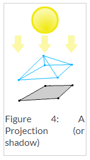
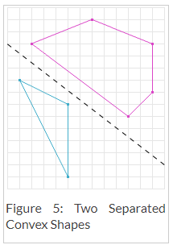
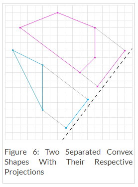
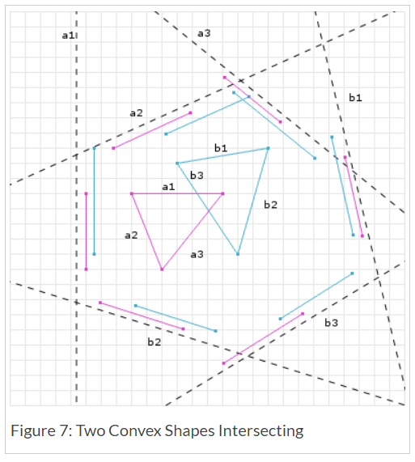
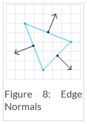
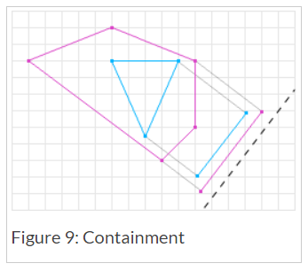

# SAT (Separating Axis Theorem) - DYN4J
Posted on January 1, 2010  \|  <http://www.dyn4j.org/2010/01/sat/>

有段时间以来我一直在想写本篇文章，但却一直没有开始。首先我想说的是 网络上有大量关于此碰撞检测算法的资源。但问题在于 在我看到的有效资源中 有很多资源对实现细节的解释常常较为含糊不清。

遂我计划去讲解此算法 并且填补一些在我自己实现中所遇到的空白。

我要说"[这里](http://www.metanetsoftware.com/technique/tutorialA.html)"是一个很棒的教程 其中带有可互交的Flash实例。

1. 介绍
2. 凸多边形
3. 投影 (Projection
4. 算法
    1. 无相交 (No Intersection
    2. 相交
5. 获取分离轴
6. 投影一个形状到一个轴
7. 寻找MTV
8. 弯曲的形状
9. 包围 (Containment
10. 一些其他要注意的事情


## 介绍
分离轴算法(Separating  Axis Theorem)，简称SAT，是一个用于确定两个凸多边形是否为相交状态的方法。该算法也可以被用于寻找最小渗透(penetration)向量 这对于物理模拟以及大量其他应用十分有用。SAT是一种快速的通用算法，它可以去除对于每种形状类型对(shape type pair)的特定碰撞检测代码的需要 从而降低了代码及维护量。

## 凸多边形性 (Convexity
如前所说，SAT是一个可以确定两个凸多边形是否相交的方法。若形状A为凸多边形，则通过该形状的任意一条线 将只会和该形状相交2次。 若一条通过该形状的线与该形状相交2次以上 那么该形状则为非凸多边形(或凹多边形Concave)。参见"[Wiki](http://en.wikipedia.org/wiki/Convex_and_concave_polygons)" 或 “[MathWorld](http://mathworld.wolfram.com/ConvexPolygon.html)”对此的定义以获得更多信息。所以让我们看看一些例子：


第一个形状被认为是凸多边形，因为此处不存在一条通过该形状且与该形状相交超过2次的线。而第二个形状则不是凸多边形，因为此处存在一条与该形状相交超过2次的线。

SAT只能处理凸多边形，但这是ok的，因为非凸形(或叫凹形)可以由凸形的组合来表示(称为凸多边形分解(convex decomposition))。所以若我们用Figure.2的凹多边形 执行一次凸多边形分解，我们将可以得到两个凸多边形。随后我们将可对其中每个凸多边形进行测试 以得到整个形状的碰撞结果。

## 投影 (Projection
SAT使用的下一个概念是投影。想象一下，你有一个光线完全平行的光源。若您将光线照射到物体上，则在该物体表面将产生阴影。阴影是三维对象的二维投影，二维对象的投影是一维"阴影"。



## 算法
SAT指出：“**若两个凸多边形没有相交，则存在一个对象的投影不会重叠的轴。**”

### 无相交
首先让我们讨论一下SAT是如何确定两个形状为不相交的。从Figure.5中我们知道这两个形状是不相交的。一条画在他们之间的直线说明了这一点。



若我们选择在Figure.5中分离两个形状的那条直线上做垂线，并将两个形状投影于该垂线上，我们将可以看到他们的投影将不会交叠。一条形状的投影间不重叠的线称之为分离轴。在Figure.6中 深灰色直线为分离轴，而相应的彩色线为对应形状在该分离轴上的投影。请注意，在figure.6中 投影没有相交，因此根据SAT规则 形状为不相交状态。



SAT可能会测试许多轴是否重叠。但是，一旦得到第一个投影不重叠的轴，算法则可即刻退出 并确定形状为不相交。由于这种早期退出，SAT非常适合用于具有许多对象但几乎没有碰撞的应用程序(例游戏，模拟等)。

为了进一步讲解，请检查以下伪代码。

```java
Axis[] axes = // 获取轴用于测试
// 遍历这些轴
for (int i = 0; i < axes.length; i++) {
  Axis axis = axes[i];
  // 将两个形状都投影在该轴上
  Projection p1 = shape1.project(axis);
  Projection p2 = shape2.project(axis);
  // 投影重叠了吗。。？
  if (!p1.overlap(p2)) {
    // 那么我们可以确保形状没有重叠
    return false;
  }
}
```

### 相交
若形状的投影在所有轴上都重叠，那么我们将得知该形状为重叠状态。Figure.7描述了两个凸多边形在许多轴上的投影测试结果。该对形状在这些轴上的投影均都重叠，因此我们可以结论该对形状为重叠状态。



为了确定是否相交，**所有**轴都必须要经过测试。将上面的代码修改过后为：

```java
Axis[] axes = // 获取轴用于测试
// 遍历这些轴
for (int i = 0; i < axes.length; i++) {
  Axis axis = axes[i];
  // 将两个形状都投影在该轴上
  Projection p1 = shape1.project(axis);
  Projection p2 = shape2.project(axis);
  // 投影重叠了吗。。？
  if (!p1.overlap(p2)) {
    // 那么我们可以确保形状没有相交
    return false;
  }
}
// 若我们到达这里，那么我们将知道每个轴都有所重叠
// 所以我们可以确保相交
return true;
```

## 获取分离轴
在我实现该算法时遇到的第一个问题则是 如何知道要测试的轴？这实际上比较简单：

**你必须要测试的轴是 形状的每一条边(edges)的法线**



边的法线可以通过反转坐标并取反来获得。例：

```java
Vector[] axes = new Vector[shape.vertices.length];
// 遍历顶点
for (int i = 0; i < shape.vertices.length; i++) {
  // 获取当前顶点
  Vector p1 = shape.vertices[i];
  // 获取下一个顶点
  Vector p2 = shape.vertices[i + 1 == shape.vertices.length ? 0 : i + 1];
  // 相减得到边向量(edge vector)
  Vector edge = p1.subtract(p2);
  // 得到任意一垂直向量
  Vector normal = edge.perp();
  // perp(垂线)方法是 (x, y) => (-y, x) or (y, -x)
  axes[i] = normal;
}
```

> 在上面的方法中，我们返回了形状每条边的垂线向量。这些向量称之为“法线”向量。然而这些向量并没有被标准化(不是单位长度)。若你只需要从SAT算法中获得一个布尔(boolean)结果，则这是没有问题的。但若你需要碰撞信息(等会将在MTV部分讨论)，那么这些向量将需要被标准化！(见 投影一个形状到一个轴 部分)。

对每个形状执行此操作将获得两个用于测试的轴列表。做到这一点 我们将更改上面的伪代码为：

```java
Axis[] axes1 = shape1.getAxes();
Axis[] axes2 = shape2.getAxes();
// 遍历axes1
for (int i = 0; i < axes1.length; i++) {
  Axis axis = axes1[i];
  // 将两个形状都投影在该轴上
  Projection p1 = shape1.project(axis);
  Projection p2 = shape2.project(axis);
  // 投影重叠了吗。。？
  if (!p1.overlap(p2)) {
    // 那么我们可以确保形状没有相交
    return false;
  }
}
// 遍历axes2
for (int i = 0; i < axes2.length; i++) {
  Axis axis = axes2[i];
  // 将两个形状都投影在该轴上
  Projection p1 = shape1.project(axis);
  Projection p2 = shape2.project(axis);
  // 投影重叠了吗。。？
  if (!p1.overlap(p2)) {
    // 那么我们可以确保形状没有相交
    return false;
  }
}
// 若我们到达这里，那么我们将知道每个轴都有所重叠
// 所以我们可以确保相交
return true;
```

## 投影一个形状到一个轴
另一个还不清楚的事情是 如何将一个形状投影在一个轴上。投影一个多边形到一个轴上是相对简单的。遍历所有顶点 对其与轴进行点乘 并存储最小值和最大值

```java
double min = axis.dot(shape.vertices[0]);
double max = min;
for (int i = 1; i < shape.vertices.length; i++) {
  // 注意: 轴必须被标准化以获得准的投影
  double p = axis.dot(shape.vertices[i]);
  if (p < min) {
    min = p;
  } else if (p > max) {
    max = p;
  }
}
Projection proj = new Projection(min, max);
return proj;
```

## 寻找MTV
到目前为止 若两个形状相交 我们只会返回true或false。除此之外，SAT可以返回一个最小变换向量(MTV Minimum Translation Vector)。MTV是用于将(两个)形状推出碰撞的最小模度向量。若我们回看Figure.7 我们可以发现 C轴有着最小的交叠。那个轴及其交叠则为MTV，轴为矢量部分，而交叠为模部分。

为确定形状是否为相交状态 我们必须遍历两个形状的所有轴，因此 我们可以同时追踪最小交叠和轴。若我们修改我们上面的伪代码以实现这一点 我们将可以在形状为互交时返回一个MTV：

```java
double overlap = // 一个超大的初始值;
Axis smallest = null;
Axis[] axes1 = shape1.getAxes();
Axis[] axes2 = shape2.getAxes();
// 遍历axes1
for (int i = 0; i < axes1.length; i++) {
  Axis axis = axes1[i];
  // 将两个形状都投影在该轴上
  Projection p1 = shape1.project(axis);
  Projection p2 = shape2.project(axis);
  // 投影重叠了吗。。？
  if (!p1.overlap(p2)) {
    // 那么我们可以确保形状没有重叠
    return false;
  } else {
    // 获取交叠
    double o = p1.getOverlap(p2);
    // 检查最小值
    if (o < overlap) {
      // 那么将最小值设置为此
      overlap = o;
      smallest = axis;
    }
  }
}
// 遍历axes2
for (int i = 0; i < axes2.length; i++) {
  Axis axis = axes2[i];
  // 将两个形状都投影在该轴上
  Projection p1 = shape1.project(axis);
  Projection p2 = shape2.project(axis);
  // 投影重叠了吗。。？
  if (!p1.overlap(p2)) {
    // 那么我们可以确保形状没有重叠
    return false;
  } else {
    // 获取交叠
    double o = p1.getOverlap(p2);
    // 检查最小值
    if (o < overlap) {
      // 那么将最小值设置为此
      overlap = o;
      smallest = axis;
    }
  }
}
MTV mtv = new MTV(smallest, overlap);
// 若我们到达这里，那么我们将知道每个轴都有所重叠
// 所以我们可以确保相交
return mtv;
```

## 弯曲的形状
我们已经知道了如何用SAT对多边形进行测试，但像圆这样弯曲的形状呢？弯曲的形状给SAT带来了一个问题 因为弯曲的形状有无数的分离轴需要测试。通常 通过拆分Circle vs Circle和Circle vs Ploygon的测试并做一些更特定的工作来解决此问题。另一个方法是完全不使用曲面形状而用高顶点数的多边形取而代之。第二个方法不需用改变以上伪代码，但是 我确实想介绍第一种选择。

让我们先来看一下Circle vs Circle。通常你会做些像这样的事情：
```java
Vector c1 = circle1.getCenter();
Vector c2 = circle2.getCenter();
Vector v = c1.subtract(c2);
if (v.getMagnitude() < circle1.getRadius() + circle2.getRadius()) {
  // 那么为相交
}
// 否则没有相交
```

我们知道，若圆心之间的距离比圆的半径之和更小，则两个圆会发生碰撞。该测试实际上是类似SAT的测试。为了在SAT中达到这一目标，我们可以执行以下操作：

```java
Vector[] axes = new Vector[1];
if (shape1.isCircle() && shape2.isCircle()) {
  // 两个圆只有一个轴测试
  axes[0] = shape1.getCenter().subtract(shape2.getCenter);
}
// 然后是上面的所有SAT代码
```

Circle vs Polygon带来了更多的问题。中心到中心测试对于多边形轴是不够的（实际上可以忽略掉中心对中心测试了）。在这种情况下 你必须包含另外的轴：从多边形上离圆心最近的顶点的轴。多边形上最接近的顶点可以通过多种方式找到，公认的解决方案是使用沃罗诺伊域(Voronoi regions)，对此我将不在本文中讨论。

其他的曲面形状将有着更大的问题 并必须被用他们自己的特定方式处理。例如一个胶囊体可以被分解为一个长方形和两个圆形。

## 包围 ( Containment
一个许多开发者选择忽略的问题是包围(Containment). 当一个形状包围着另一个形状时会发生什么？由于大多数应用程序从不会发生这种情况，因此该问题通常并不怎么大。首先 让我解释一下这个问题及其解决方法。然后我将会说明为什么要考虑这一点。



若在SAT中有一个形状包围住了另一个形状，用我们到目前为止的伪代码 将会返回一个不正确的MTV。矢量和模部分都可能不正确。Figure.9显示了返回的交叠不足以将形状移出互交。因此，我们需要做的是在交叠测试中检查是否包围。仅从上面的SAT代码中加入判断语句：
```java
if (!p1.overlap(p2)) {
  // 那么我们可以确保形状没有相交
  return false;
} else {
  // 获取交叠
  double o = p1.getOverlap(p2);
  // 检查包围
  if (p1.contains(p2) || p2.contains(p1)) {
    // 交叠+最小终点的距离
    double mins = abs(p1.min - p2.min);
    double maxs = abs(p1.max - p2.max);
    // 注意: 由于取决于更小的那个值，你可能需要反转分离轴！！ ..[?]
    if (mins < maxs) {
      o += mins;
    } else {
      o += maxs;
    }
  }
  // 检查最小值
  if (o < overlap) {
    // 那么将最小值设置为此
    overlap = o;
    smallest = axis;
  }
}
```
原因1：形状可能会被设置成这种情况。若不处理此问题将需要两次或多次SAT迭代才能解决碰撞，具体取决于形状的相对大小。

原因2：如果您打算支持Line Segment vs. Other shapes，则必须这样做，因为在某些情况下重叠可能为零（这是因为线段是无限细的形状）。

## 一些其他要注意的事情

一些其他要注意的事情：

- 可以通过不测试平行的轴来减少要测试的轴的数量。这就是为什么一个矩形只有两个轴要测试的原因。
- 如果矩形等形状具有自己的投影和getAxes代码，则它们的执行速度会更快，因为矩形不需要测试4个轴，而实际上只需测试2个轴即可。
- 最后一个分离轴可用于引发SAT的下一次迭代，以便在非相交情况下该算法可以为O（1）。 ..[?]
- 3D中的SAT最终可能会测试**很多**轴。
- I’m not an expert and please excuse my terrible graphics.
