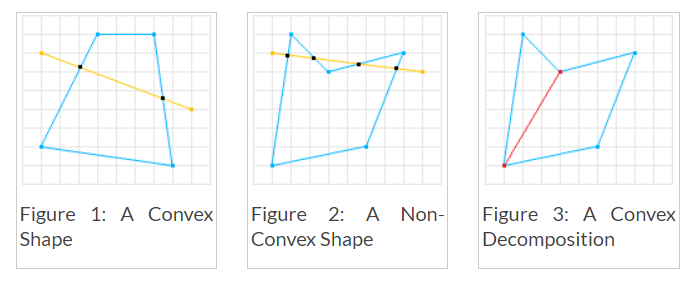

# SAT (Separating Axis Theorem) - DYN4J
Posted on January 1, 2010  \|  <http://www.dyn4j.org/2010/01/sat/>

我有段时间以来一直在想做本篇文章，但却一直没有开始。首先我想说的是 网络上有大量的资源关于此碰撞检测算法。但问题是 在我看到的有效资源中 有很多资源对实现细节的解释常常较为含糊不清。

遂我计划去讲解此算法 并且填补一些空白对于我自己在实现中所遇到的。

首先我要说"[这里](http://www.metanetsoftware.com/technique/tutorialA.html)"是一个很棒的教程 其中带有可互交的Flash实例。

1. 介绍
2. 凸多边形
3. 投射 (Projection
4. 算法
    1. 无路口 (No Intersection
    2. 路口
5. 获取分离轴
6. 投射一个形状到一个轴
7. 寻找MTV
8. 弯曲的形状
9. 遏制 (Containment
10. 其他事情需要注意的

## 介绍
分离轴算法，简称SAT，是一个方法用于确定是否两个凸多边形为相交状态。该算法也可以被用于寻找最小渗透向量 这十分有用对于物理模拟以及大量其他应用。SAT是一种快速的通用算法，它可以去除对于每种形状类型对(shape type pair)的特定碰撞检测代码的需要 从而降低了代码及维护量。

## 凸多边形性 (Convexity
如前所说，SAT是一个方法可以确定是否两个凸多边形相交。若形状A为凸多边形，则通过该形状的任意一条线 将只会和该形状相交2次。 若一条通过该形状的线与该形状相交2次以上 那么该形状则为非凸多边形(或凹多边形Concave)。参见"Wiki" 或 “MathWorld”对此的定义以获得更多数学和式子上的信息。所以让我们看看一些例子：

第一个形状被认为是凸多边形，因为此处不存在一条通过该形状且与该形状相交超过2次的线。而第二个形状则不是凸多边形，因为此处存在一条与该形状相交超过2次的线。

SAT只能处理凸多边形，但这是ok的，因为非凸形(或凹形)可以由凸形的组合来表示(称为凸多边形分解(convex decomposition))。所以若我们用Figure.2的凹多边形 执行一次凸多边形分解，我们将可以得到两个凸多边形。随后我们将可对其中每个凸多边形进行测试 以得到整个形状的碰撞结果。

## 投射 (Projection
SAT使用的下一个概念是投射。想象一下，你有一个光线完全平行的光源。若您将光线照射到物体上，则在该物体表面将产生阴影。阴影是三维对象的二维投射，二维对象的投射是一维"阴影"。

## Algorithm

