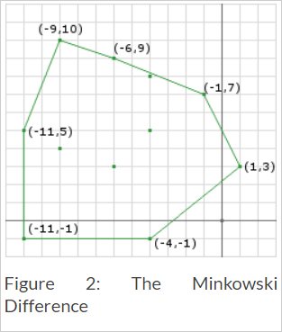

# GJK – Distance & Closest Points - DYN4j
Posted on April 26, 2010 \| <http://www.dyn4j.org/2010/04/gjk-distance-closest-points/>


原文 | [GJK – Distance & Closest Points](http://www.dyn4j.org/2010/04/gjk-distance-closest-points/)
--- | --- 
作者 | William
翻译 | Dreamtowards
校对 | 暂无校对

[上一次](http://www.dyn4j.org/archives/88)我们讨论了GJK算法关于碰撞检测的部分。不过该算法原本是用于获取于两个凸多边形之间的距离和最近点(可为多个)的。

1. 介绍
2. 总览
3. 明可夫斯基和 (Minkowski Sum
4. 距离 (The Distance
5. 迭代
6. 最近点 (Closest Points
7. 凸形组合 (Convex Combination

## 介绍
该算法在确定形状间的距离(的部分)上使用了许多(与碰撞检测部分)相同的概念。该算法为迭代性的，使用明可夫斯基和/差，寻找原点，以及使用相同的support函数。

## 总览
我们知道若形状不为相交状态，那么明可夫斯基差将不会包含原点。因此，相比于迭代性的尝试去闭合单面的原点，我们将更想去生成一个最接近于原点的单面。最接近(于原点..?)的单面将始终在Minkowski差的边(edge)上。在2D中，最接近的单面可以是一个单独的点或一条线。


## 明可夫斯基和 (Minkowski Sum
就如我们于上一文中在GJK的碰撞检测部分所做的一样，(了解)该算法也需要知道明可夫斯基和(我将会称他为明可夫斯基差，请见GJK文章)。

取来自GJK一文中的那两个形状 并分离他们(Figure.1) 并产生仅经过略微偏移的几乎相同的明可夫斯基差(Figure.2)。我们注意到原点并没有包含在该明可夫斯基差内，因此这不是一个碰撞。



## 距离 (The Distance
距离可以被 通过寻找在明可夫斯基差上 离原点最近的点 的方法所计算出来。通过审查图片，我们看见了 点(-4,-1)和点(1,3)所创建的那条边(edge) 是最接近于原点的那个特征(feature)(单面..?)。通常情况下，最接近于原点的点是此边(edge)上与原点形成直角的点。我们可以这样来计算这个点：

```java
A = (-4, -1)
B = (1, 3)
// 创建线
AB = B-A = (5, 4)
AO = O-A = (4, 1)
// 将AO投影至AB
AO dot AB = 4*5 + 1*4 = 24
// 获取 长度的平方
AB dot AB = 5*5 + 4*4 = 41
// 计算沿AB的长度
t = 24 / 41
// 计算the点
AB.mult(t).add(A) = (120 / 41, 96 / 41) + (-4, -1)
                  = (-44 / 41, 55 / 41)
                  ≈ (-1.07, 1.34)
d = (-1.07, 1.34).magnitude() ≈ 1.71
```

这是一个简单的计算，因为我们知道我们要用哪些明可夫斯基差的点。


## 迭代
就像GJK的碰撞检测环节，其距离环节也是迭代性的(且几乎一样)。我们需要迭代性的构建一个 包含于明可夫斯基差上的 至原点最近的点(可不止一个)的 单面。点将以和选择方向相近的方式被收集，使用support函数，和检查退出情况。

让我们检查一些伪代码：

```java
// exactly like the previous post, use whatever 
// initial direction you want, some are more optimal
d = // choose a direction
// obtain the first Minkowski Difference point using
// the direction and the support function
Simplex.add(support(A, B, d));
// like the previous post just negate the
// the prevous direction to get the next point
Simplex.add(support(A, B, -d));
// obtain the point on the current simplex closest 
// to the origin (see above example)
// start the loop
d = ClosestPointToOrigin(Simplex.a, Simplex.b);
while (true) {
  // the direction we get from the closest point is pointing
  // from the origin to the closest point, we need to reverse
  // it so that it points towards the origin
  d.negate();
  // check if d is the zero vector
  if (d.isZero()) {
    // then the origin is on the Minkowski Difference
    // I consider this touching/collision
    return false;
  }
  // obtain a new Minkowski Difference point along
  // the new direction
  c = support(A, B, d);
  // is the point we obtained making progress
  // towards the goal (to get the closest points
  // to the origin)
  double dc = c.dot(d);
  // you can use a or b here it doesn't matter
  // since they will be equally distant from
  // the origin
  double da = Simplex.a.dot(d);
  // tolerance is how accurate you want to be
  if (dc - da < tolerance) {
    // if we haven't made enough progress, 
    // given some tolerance, to the origin, 
    // then we can assume that we are done
 
    // NOTE: to get the correct distance we
    // need to normalize d then dot it with
    // a or c
    // OR since we know that d is the closest 
    // point to the origin, we can just get 
    // its magnitude
    distance = d.magnitude();
    return true;
  }
  // if we are still getting closer then only keep
  // the points in the simplex that are closest to
  // the origin (we already know that c is closer
  // than both a and b so we only need to choose
  // between these two)
  p1 = ClosestPointToOrigin(Simplex.a, c);
  p2 = ClosestPointToOrigin(c, Simplex.b);
  // getting the closest point on the edges AC and
  // CB allows us to compare the distance between
  // the origin and edge and choose the closer one
  if (p1.magnitude() < p2.magnitude()) {
    Simplex.b = c;
    d = p1;
  } else {
    Simplex.a = c;
    d = p2;
  }
}
```