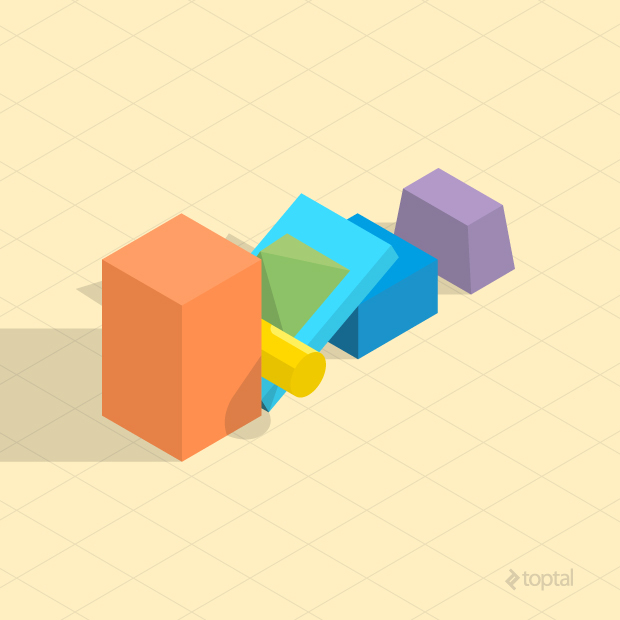

# Video Game Physics Tutorial - Part I: An Introduction to Rigid Body Dynamics

原文 | [Video Game Physics Tutorial - Part I: An Introduction to Rigid Body Dynamics](https://www.toptal.com/game/video-game-physics-part-i-an-introduction-to-rigid-body-dynamics)
--- | --- 
作者 | Nilson Souto
翻译 | Dreamtowards
校对 | 暂无校对

本文为我们的视频游戏物理3章系列的第一章。本系列其他的部分，请见：
- [Part II: Collision Detection for Solid Objects](https://www.toptal.com/game/video-game-physics-part-ii-collision-detection-for-solid-objects)
- [Part III: Constrained Rigid Body Simulation](https://www.toptal.com/game/video-game-physics-part-iii-constrained-rigid-body-simulation)

物理模拟是计算机科学中的一项领域，其意旨(通常)为使用计算机来重现物理现象。一般情况下，这些模拟 将数字化的方法应用于现有的理论 以获得尽可能接近于我们在主世界中所见的(现象) 的结果。这允许我们 以[高级游戏开发者](https://www.toptal.com/game)的身份，去预测和仔细的分析 在构成他们之前 一些事情将会有着如何样的行为/表现，何者的简洁性和开销最优。

<!--  -->

物理模拟的应用范围乃是巨大。计算机最早是用于执行物理模拟的，例如 预测弹射性物体的弹道运动。他也是民事和自动化工程的一个基本器具。{illuminating how certain structures would behave in events like an earthquake or a car crash. }以及他不止于此。我们可以模拟 如天体物理学，相对论 及很多我们可在自然奇观中观察到的其他疯狂的事物。

模拟物理在视频游戏中是很常见的，因为许多游戏{are inspired by things we have in the real world}。有些游戏完全依靠于物理模拟为主要特性。这意味着这些游戏需要一个不会崩溃或变卡的稳定的模拟，但这通常并非易事。

在许多游戏中，只有几个物理效果是关切的。刚体动力学 - 固体的运动与互交。硬硬的物体 - 是迄今为止在游戏模拟中最常见的一种。那是因为{most of the objects we interact with in real life are fairly rigid}，以及模拟刚体是相对简单的(正如我们将会看到的，这并不意味着他易如反掌)。一小部分其他游戏则需要模拟更为复杂的实体，如可变性物体，流体，磁性物体等。。

在这个视频游戏物理教学系列，我们将会探索刚体模拟。以本文中较为简单的刚体运动开始，随后于接下来的章节中讨论 通过碰撞和约束 对多个刚体间进行互交。应用于像[Box2D](http://box2d.org/), [Bullet Physics](http://bulletphysics.org/wordpress/)和[Chipmunk Physics](https://chipmunk-physics.net/)这样的现代游戏物理引擎中的最常见的公式 (也)将会被呈现并讲解。


## 刚体动力学

在视频游戏物理中，我们想要在显示效果上让物体进行变换(动画)，并让他们有着真实的物理行为。这是通过 基于物理程序的变换以实现的 - 通过应用于物理论法的数值计算而产生的变换。

{...1pgra}

物理引擎是执行物理模拟的软件元件。他接收一个特定的要去被模拟的物体，加上一些配置参数，然后模拟则可以逐步进行(stepped)。每一步(each step) 通过一个秒的一小分(fractions) 模拟向前移动(向后则是向前移动负数..)，随后结果将可以被显示于屏幕上。请注意 物理引擎只执行数值计算(我觉得。。 光是callback就无法确定了 以及最基本的持有对象操作)。何样的执行结果或许依赖于游戏的需求。并非每一步(step)的结果都总是想显示在屏幕上。

刚体的运动可以被用 [牛顿机械学](https://en.wikipedia.org/wiki/Classical_mechanics) 以建模，即 由艾萨克·牛顿所建立的 著名的[运动(三)定律](https://en.wikipedia.org/wiki/Newton%27s_laws_of_motion):

1. Inertia(惯性): 若一个物体没有被受力，他的速度(velocity)(运动的速率和方向)将不会改变。

2. Force, Mass, and Acceleration: 应用于物体的力等于该物体的质量乘以其加速度(velocity的变化率)。这是由公式 F=ma 而得出。

3. Action and Reaction: “For every action there is an equal and opposite reaction.”，另一种说法，每当一个物体对另一个物体发力，那个第二个物体(也)将发相同幅度(magnitude)且相反方向的力 于第一个物体。

基于这三个定律，我们可以让现在的物理系统能够产生我们熟悉的动力行为，并给玩家带来一个{imsv}体验。

下图从总体上概述了物理引擎的一般过程：


## 向量
为了了解物理引擎如何工作，有一个对向量(和运算操作)的基本了解是紧要的。若你已经熟悉向量数学，那么请继续阅读。但若你不是，或你想再复习复习，花点时间去看看本文后面的[附录](https://www.toptal.com/game/video-game-physics-part-i-an-introduction-to-rigid-body-dynamics#appendix)。

## 粒子模拟
一个(用于)理解刚体模拟的很好的垫脚石是从粒子开始。模拟粒子要比模拟刚体简单，并且我们可以使用相同的法则模拟后者，只是要添加体积和形状(至粒子)。

粒子是空间上一个带有{位置向量, 速度向量, 和质量(position, velocity, mass)}的点。根据牛顿第一定律，该粒子的速度只应在其受到力后才产生变化。当他的速度向量为非零长度时，其位置将会随时间推移而变化。

模拟一个粒子系统，我们首先要去创建一个带有初始状态的粒子数组。每一个粒子(必须)<sup>(这个必须是原文中的 不是我加的。。加括号只是为助于阅读 以去除长句中不必要的词..)</sup>有一个质量，一个空间上的初始位置，及一个初始速度。随后我们将开始模拟的主循环。对于每一个粒子，我们将要去计算当前作用于其上的力，通过由当前力产生的加速度以更新其速度，并基于我们刚计算出的速度更新其位置。

力可能来自不同的(各种)来源，这取决于模拟的方式。他可以是引力，风，或磁力等，或也可以是这些(力)的组合。他可以是一个全局力，像常量引力，或也可以是粒子之间的力，像吸引或排斥。

为了让模拟以现实的(时间/速度的)步伐运行，我们"模拟"的时间步(timeStep/delta)应该与实际中我们 自上一步模拟时 所过去的时间 相同。然而，时间步可以被调大以让模拟变得更快，或调小以让模拟以慢速运行。

假设我们有一个质量为*m*, 位置为 *p(t[i])* 及速度为 *v(t[i])* 的粒子 在时间为*t[i]*的那一片刻，一个力 *f(t[i])* 应用于了该粒子，那么该粒子在未来的时间点 *t[i+1]* 的位置和速度 分别表示 *p(t[i+1])*, *v(t[i+1])*，及他们的计算方法为：


在技术上，我们在这所做的为 使用semi-implicit Euler方法<sup>(标准情况下linVel的积分式后面还有一项)</sup> 数值积分一个通常粒子的运动微分方程。由于其简单性及其在较小的时间跨度(*dt*/上文的时间步/timeStep/delta)中的可接受的准确性 大多数游戏物理引擎都采用这种方法。来自很棒的《[Physically Based Modeling: Principles and Practice](http://www.cs.cmu.edu/~baraff/sigcourse/index.html)》课程的[Differential Equation Basics](http://www.cs.cmu.edu/~baraff/sigcourse/notesb.pdf)演讲笔记, by Drs. Andy Witkin and David Baraff，是一个很棒的文章，可以深入了解该方法的数值方法。

下面是一个用C语言的物理模拟的例子 :

```c
#define NUM_PARTICLES 1

// Two dimensional vector.
typedef struct {
    float x;
    float y;
} Vector2;

// Two dimensional particle.
typedef struct {
    Vector2 position;
    Vector2 velocity;
    float mass;
} Particle;

// Global array of particles.
Particle particles[NUM_PARTICLES];

// Prints all particles' position to the output. We could instead draw them on screen
// in a more interesting application.
void  PrintParticles() {
    for (int i = 0; i < NUM_PARTICLES; ++i) {
        Particle *particle = &particles[i];
        printf("particle[%i] (%.2f, %.2f)\n", i, particle->position.x, particle->position.y);
    }
}

// Initializes all particles with random positions, zero velocities and 1kg mass.
void InitializeParticles() {
    for (int i = 0; i < NUM_PARTICLES; ++i) {
        particles[i].position = (Vector2){arc4random_uniform(50), arc4random_uniform(50)};
        particles[i].velocity = (Vector2){0, 0};
        particles[i].mass = 1;
    }
}

// Just applies Earth's gravity force (mass times gravity acceleration 9.81 m/s^2) to each particle.
Vector2 ComputeForce(Particle *particle) {
    return (Vector2){0, particle->mass * -9.81};
}

void RunSimulation() {
    float totalSimulationTime = 10; // The simulation will run for 10 seconds.
    float currentTime = 0; // This accumulates the time that has passed.
    float dt = 1; // Each step will take one second.
    
    InitializeParticles();
    PrintParticles();
    
    while (currentTime < totalSimulationTime) {
        // We're sleeping here to keep things simple. In real applications you'd use some
        // timing API to get the current time in milliseconds and compute dt in the beginning 
        // of every iteration like this:
        // currentTime = GetTime()
        // dt = currentTime - previousTime
        // previousTime = currentTime
        sleep(dt);

        for (int i = 0; i < NUM_PARTICLES; ++i) {
            Particle *particle = &particles[i];
            Vector2 force = ComputeForce(particle);
            Vector2 acceleration = (Vector2){force.x / particle->mass, force.y / particle->mass};
            particle->velocity.x += acceleration.x * dt;
            particle->velocity.y += acceleration.y * dt;
            particle->position.x += particle->velocity.x * dt;
            particle->position.y += particle->velocity.y * dt;
        }
        
        PrintParticles();
        currentTime += dt;
    }
}
```

若你调用`RunSimulation`函数(对于单个粒子)，他将会打印一些像是这样的内容：

```
particle[0] (-8.00, 57.00)
particle[0] (-8.00, 47.19)
particle[0] (-8.00, 27.57)
particle[0] (-8.00, -1.86)
particle[0] (-8.00, -41.10)
particle[0] (-8.00, -90.15)
particle[0] (-8.00, -149.01)
particle[0] (-8.00, -217.68)
particle[0] (-8.00, -296.16)
particle[0] (-8.00, -384.45)
particle[0] (-8.00, -482.55)
```

正如你所见，该粒子从 (-8, 57) 的位置开始，随后他的y坐标开始越来越快的下降，因为他在引力的力的作用下加速向下。

下面的图直观地展示了一个单个粒子从开始模拟后 的三个步骤的序列：


最初当 t=0 时，粒子位于 p[0]。一步后，该粒子移动到了其速度向量 v[0] 所指向的方向<sup>虽然第一步就已经有力了，但是通常不起作用。第一轮t=0时dt通常也为0 所以这一步应该会消掉(第一步无法预测已过的时间 除非是柏林时间1970年至今的dt 那也是不符合逻辑的)，不过上面的代码却是固定dt的。。</sup>。在下一步，一个力 *f*[1] 应用于了其上，随后速度向量开始向力向量所推的那个方向改变。在之后的两步，力向量改变了方向，但仍然在将粒子向上推。


## 刚体模拟

[刚体](https://en.wikipedia.org/wiki/Rigid_body)是一个无法变形的固体。这样的固体在实际世界是不存在的 - 即使是最硬的材质 在受到一些力后 也至少会有一些非常轻微的变形。但刚体对于物理系统是非常有用的模型，它简化了我们对可忽略变形的实体的固体动力学的研究。

刚体通常围绕其[质心](https://en.wikipedia.org/wiki/Center_of_mass)(center of mass)旋转，且刚体的位置(通常)被认为是其质心的位置。我们定义刚体的初始状态为质于原点(位置) 以及一个零旋转角。其位置和旋转在任何时刻 *t* 都将为初始状态的偏移量。


质心是(一个)物体的质量分布的中心点。若你想象一个刚体的质量 *M*，是由 *N* 个小粒子组成，其中每一个粒子的 质量为 *m[i]* 及(其)相对于刚体的位置(location)为 *r[i]*，那么质心可以被计算为:


该公式表明，质心为 按其(粒子)质量加权的粒子位置的平均值。若整个物体的密度完全均匀，那么质心与物体形状的几何中心相同，这也被称为 **centroid**。游戏物理引擎通常只支持均匀密度，所以可以将几何中心用作为质心(center of mass)。